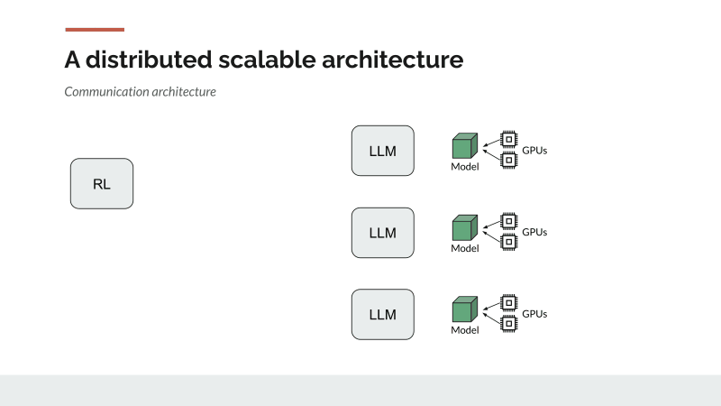
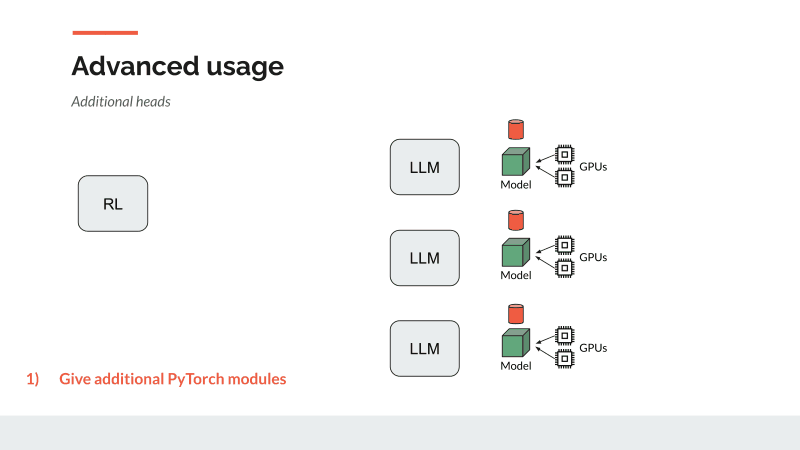
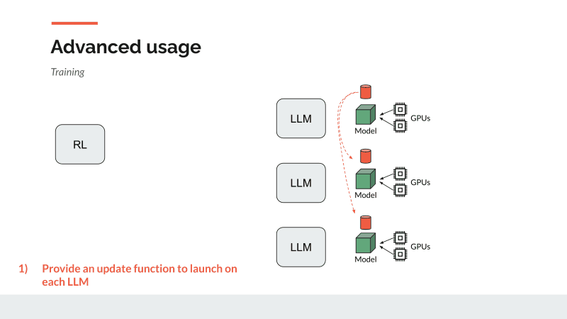
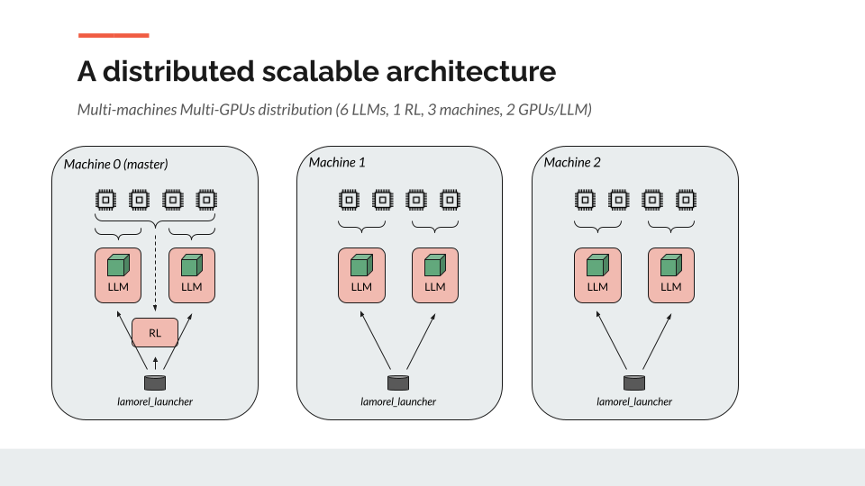

# Language Models for Reinforcement Learning - *Lamorel*

*Lamorel* is a Python library designed for RL practitioners eager to use Large Language Models (LLMs).
It is more generally built to use LLMs at scale in interactive environments. It relies on a client-server(s) architecture where your RL script acts as the client sending requests to the LLM server(s). In order to match the computation requirements of RL, *Lamorel* can deploy multiple LLM servers and dispatch the requests on them without any modification in your code.


## Why *Lamorel*?
1. Abstracts the use of LLMs (e.g. tonekization, batches) into simple calls
```python
lm_server.generate(contexts=["This is an examples prompt, continue it with"])
lm_server.score(contexts=["This is an examples prompt, continue it with"], candidates=["a sentence", "another sentence"])
```
2. Provides a method to compute the probability of token sequences (e.g. action commands) given a prompt
3. Is made for scaling up your experiments by deploying multiple instances of the LLM and dispatching the computation thanks to a simple configuration file
```yaml
  distributed_setup_args:
    n_rl_processes: 1
    n_llm_processes: 1
```
4. Provides access to open-sourced LLMs from the [Hugging Face's hub](https://huggingface.co/models) along with  [Model Parallelism](https://huggingface.co/docs/transformers/v4.15.0/parallelism) to use multiple GPUs for an LLM instance
```yaml
  llm_args:
    model_type: seq2seq
    model_path: t5-small
    pretrained: true
    minibatch_size: 4
    parallelism:
      use_gpu: true
      model_parallelism_size: 2
```
5. Allows one to give their own PyTorch modules to compute custom operations (e.g. to add new heads on top of the LLM)
6. Allows one to train the LLM (or part of it) thanks to a [Data Parallelism](https://pytorch.org/tutorials/intermediate/ddp_tutorial.html) setup where the user provides its own update method 


## Installation
1. `cd lamorel`
2. `pip install .`

## How to use *Lamorel*
*Lamorel* is built of three main components:
- a Python API to interact with LLMs
- a configuration file to set the LLM servers
- a launcher deploying the multiple LLM servers and launching your RL script

### Instantiating the server in your RL script
*Lamorel* leverages [hydra](https://hydra.cc/) for its configuration file. Because of this, you need to add the hydra decorator on top of your `main` function.
Then, you must instantiate the `Caller` class from *Lamorel* which will create the object allowing you to interact with the LLM servers.
Do not forget to initialize *Lamorel* once imported with `lamorel_init()` to initialize the communication with the servers. 
```python
import hydra
from lamorel import Caller, lamorel_init
lamorel_init()

@hydra.main(config_path='../config', config_name='config')
def main(config_args):
    lm_server = Caller(config_args.lamorel_args)
    # Do whatever you want with your LLM
    lm_server.close()
if __name__ == '__main__':
    main()
```
Do not forget to close the connection with servers at the end of your script.

### Using the Caller
Once instantiated, you can use the different methods of the `Caller` object to send requests to your LLMs.

#### Scoring
First, we provide the `score` method to compute the probability of a sequence of tokens (a `candidate`) given a prompt (`context`).
*Lamorel* allows to provide multiple candidates for a single context but also to batch this computation for multiple contexts (along with their associated candidates). Using this, one can use a classic vectorized RL setup where at each step, multiple environments running in parallel return their current state and expect an action. 
```python
lm_server.score(contexts=["This is an examples prompt, continue it with"], 
                candidates=[["a sentence", "another sentence"]])
```

#### Generation
*Lamorel* also provides a method for text generation. Similarly to the `score` method, one can give multiple prompts (`contexts`).
Our `generate` method can use any keyword argument from [Transformers API](https://huggingface.co/docs/transformers/main_classes/text_generation).
In addition of the generated texts, it also returns the probability of each generated sequence.

```python
lm_server.generate(contexts=["This is an examples prompt, continue it with"])
lm_server.generate(contexts=["This is an examples prompt, continue it with"], temperature=0.1, max_length=25)
```

#### Custom modules
While *Lamorel* provides two main uses of LLMs (i.e. scoring and generating), we also allow users to provide their own methods to perform custom operations using LLMs.
We expect these custom methods to be [PyTorch modules](https://pytorch.org/docs/stable/generated/torch.nn.Module.html).


In order to define such a custom operation, users must extend our `BaseModuleFunction` class.
For this, you must extend two main methods:
- `initialize(self)`: initialize your custom operations here.
- `forward(self, forward_outputs, minibatch, tokenized_context, **kwargs)`: perform your operations here and return the results.

*Lamorel* will give your custom module to all LLM servers and ensure your variables (e.g. weights) are the same on each server. 
See the example below where we implement a Multi Layer Perceptron (MLP) on top of our LLM.

```python
from lamorel import BaseModuleFunction

class TwoLayersMLPModuleFn(BaseModuleFunction):
    def __init__(self, model_type, n_outputs):
        super().__init__()
        self._model_type = model_type
        self._n_outputs = n_outputs

    def initialize(self):
        '''
        Use this method to initialize your module operations.
        - self.llm_config gives the configuration of the LLM (e.g. useful to know the size of representations)
        - self.device gives you access to the main device (e.g. GPU) the LLM is using
        '''
        llm_hidden_size = self.llm_config.to_dict()[self.llm_config.attribute_map['hidden_size']]
        self.mlp = torch.nn.Sequential(
            torch.nn.Linear(llm_hidden_size, 128),
            torch.nn.Linear(128, 128),
            torch.nn.Linear(128, self._n_outputs),
        ).to(self.device)

    def forward(self, forward_outputs, minibatch, tokenized_context, **kwargs):
        '''
        Perform your operations here.
        - forward_outputs gives access the output of the computations performed by the LLM (e.g. representations of each layer)
        - minibatch gives access to the input data (i.e. a prompt and multiple candidates) given to the LLM
        - tokenized_context gives access to the prompt used
        '''
        # Get the last layer's representation from the token right after the prompt
        if self._model_type == "causal": # adapt to the Transformers API differing between Encoder-Decoder and Decoder-only models
            model_head = forward_outputs['hidden_states'][0][0, len(tokenized_context["input_ids"])-1, :]
        else:
            model_head = forward_outputs['encoder_last_hidden_state'][0, len(tokenized_context["input_ids"]) - 1, :]
        
        # Give representation to our MLP
        output = self.mlp(model_head)
        return output
```

Once implemented, you can give your custom module(s) to the *Lamorel* `Caller` (along with a key). It will then be possible to use your module:
- either by calling it directly using the `custom_module_fns`
- or by using it in addition of scoring

```python
lm_server = Caller(config_args.lamorel_args,
                   custom_module_functions={
                       'mlp_head': TwoLayersMLPModuleFn(config_args.lamorel_args.llm_args.model_type, 2)
                   })
# Direct call
lm_server.custom_module_fns(module_function_keys=['mlp_head'],
                            contexts=["This is an examples prompt, continue it with"])

# Scoring
lm_server.score(additional_module_function_keys=['mlp_head'],
                contexts=["This is an examples prompt, continue it with"], 
                candidates=["a sentence", "another sentence"])
```

#### Updaters

We have seen so far how to use an LLM (along with possibly custom modules) for inference. However, *Lamorel* also provides tools to update (e.g. train) these operations with a `BaseUpdater` class which can be extended and perform any update operation. Our class gives access to the whole computation graph `self._llm_module`.
It can for instance be used to perform operations with gradient by calling `self._llm_module(['mlp_head', '__score'], ...)` with the leaf operations wanted (i.e. scoring and/or custom modules) or to select weights to train (the LLM itself `self._llm_module._LLM_model`, custom modules `self._llm_module.module._module_functions`, the whole graph `self._llm_module`).

```python
from lamorel import BaseUpdater

class TestUpdater(BaseUpdater):
    def perform_update(self, contexts, candidates, _current_batch_ids, **kwargs):
        if not hasattr(self, 'loss_fn'):
            self.loss_fn = torch.nn.CrossEntropyLoss()
        if not hasattr(self, 'optimizer'):
            # You can train:
            # 1. Only the LLM
            # self.optimizer = torch.optim.Adam(self._llm_module._LLM_model.parameters())
            
            # 2. Only some custom modules
            self.optimizer = torch.optim.Adam(self._llm_module.module._module_functions["mlp_head"].parameters())
            
            # 3. Everything
            # self.optimizer = torch.optim.Adam(self._llm_module.parameters())
        
        # Use the computational graph with gradient
        # 1. Only the LLM's scoring module
        # output = self._llm_module(['__score'], contexts=contexts, require_grad=True)
        
        # 2. Only some custom modules
        output = self._llm_module(['mlp_head'], contexts=contexts, require_grad=True)
        
        # 3. Both
        # output = self._llm_module(['__score', 'mlp_head'], contexts=contexts, require_grad=True)
        
        # Stack outputs to batch loss computation
        stacked_output = torch.stack([_o["mlp_head"] for _o in output]).to('cpu')
        
        # Compute loss with the labels corresponding to the current batch
        loss = self.loss_fn(stacked_output, kwargs["labels"][_current_batch_ids, :])
        
        # Compute gradients and update graph
        loss.backward()
        self.optimizer.step()
        self.optimizer.zero_grad()
        
        # Return anything you want using a dictionary
        return {"loss": loss}
```

Once defined, users must give their custom Updater to the Caller. Note that Updater's constructor can take keyword arguments using config files (see next section).

Whenever needed, users can call their Updater with data (i.e. contexts and candidates) along with any additional keyword argument (e.g. labels).
Because multiple LLM servers can be deployed, we also dispatch the Updater's computation. When one calls the Updater with data, contexts and candidates are dispatched over the multiple servers (where each runs the Updater). 
Because *Lamorel* does not know a priori what additional keyword arguments are, these are copied and sent to each LLM. As users may need to know how to associate these arguments to the data handled by the current server,
we provide the `_current_batch_ids` variable giving the indexes of contexts (and by extension candidates) that are given to the current LLM. 

*Lamorel* is in charge of gathering the gradients of all servers such that `self.optimizer.step()` produces the same on each server.
```python
lm_server = Caller(config_args.lamorel_args,
                   custom_module_functions={
                       'mlp_head': TwoLayersMLPModuleFn(config_args.lamorel_args.llm_args.model_type, 2)
                   },
                   custom_updater_class=TestUpdater)

result = lm_server.update(
            contexts=["This is an examples prompt, continue it with"],
            candidates=["a sentence"],
            labels=torch.tensor([0, 1], dtype=torch.float32),
        )
losses = [r["loss"] for r in result] # one loss returned per LLM
```



### Setting up the configuration
The configuration of the LLM and the client-server(s) architecture is done using a YAML configuration file following [hydra](https://hydra.cc/)'s API.
Here is what this file should contain:
```yaml
lamorel_args: # Arguments for Lamorel
  log_level: debug # (debug, info, error): level of logs returned by Lamorel
  allow_subgraph_use_whith_gradient: false #
  distributed_setup_args: # Use this section to specify how many LLM servers must be deployed
    n_rl_processes: 1
    n_llm_processes: 1 # LLM servers
  accelerate_args: # Lamorel leverages Hugging Face Accelerate for the distributed setup
    config_file: accelerate/default_config.yaml # keep this
    machine_rank: ??? # each machine should launch the script and provide its rank (id), see section below
    num_machines: 2 # number of machines used in the experiment
  llm_args: # Specify which LLM to use and how 
    model_type: seq2seq # (seq2seq, causal): Encoder-Decoder or Decoder-Only model
    model_path: t5-small # name (if downloaded from the Hugging Face's hub) or (absolute) path to the model
    pretrained: true # (true, false): set this to false if you want to keep the LLM's architecture but re-initialize its wegihts
    minibatch_size: 4 # number of candidates to batch per forward, adapt this number to your GPU memory
    parallelism: # Model parallelism
      use_gpu: true # (true, false) set this to false if you want your LLM(s) to use CPU
      model_parallelism_size: 1 # number of GPUs user per LLM server
      synchronize_gpus_after_scoring: false # only useful for specific GPU optimizations
      empty_cuda_cache_after_scoring: false # only useful for specific GPU optimizations
  updater_args: # add here args you would like to give to your Updater's constructor
rl_script_args: # Arguments for Lamorel
  path: ??? # absolute path to your RL script 
  # Provide any additional arguments for your RL script here
```
Examples of configuration files are provided in section below.

### Launch
*Lamorel* comes with a launcher that handles how to launch multiple processes on each machine. To launch your experiment on a machine, you must use the following command:
```
python -m lamorel_launcher.launch --config-path <path> --config-name <name> rl_script_args.path=<path> lamorel_args.accelerate_args.machine_rank=<rank> <additional arguments to override config>
```
*Warning: use absolute paths*

#### Launch examples
Several examples of configurations can be found in [examples](examples).

##### Single machine and no GPU
- Config: [local_cpu_config.yaml](examples/configs/local_cpu_config.yaml)
- Launch command(s):
    - ```shell
        python -m lamorel_launcher.launch --config-path absolute/path/to/project/examples/configs --config-name local_cpu_config rl_script_args.path=absolute/path/to/project/examples/example_script.py
      ```

##### Single machine and GPU(s)
- Config: [local_gpu_config.yaml](examples/configs/local_gpu_config.yaml)
- Launch command(s):
    - ```shell
        python -m lamorel_launcher.launch --config-path absolute/path/to/project/examples/configs --config-name local_gpu_config rl_script_args.path=absolute/path/to/project/examples/example_script.py
      ```

If you do not want your LLM process to use all your GPUs (for instance if you plan to launch multiple LLM servers), set an appropriate value to `model_parallelism_size` in the config.

##### SLURM cluster
We here provide an example with a SLURM cluster where our experiment deploys 6 LLM servers on 3 machines. As the schema below shows, the first machine hosts 2 LLM servers and the RL script (which also has access to GPUs).
The two other machines both host only 2 LLM servers.

- Config: [multi-node_slurm_cluster_config.yaml](examples/configs/multi-node_slurm_cluster_config.yaml)
- Launch command(s):
    - ```shell
        sbatch examples/slurm/job.slurm
      ```

### Example scripts
We provide an [example_script](examples/agent_scienceworld.py) with a simple loop running a LLM agent in a non-vectorized version of [ScienceWorld](https://github.com/allenai/ScienceWorld).

## Technical details and contributions
*Lamorel* relies on Pytorch distributed for communications. We chose to use the GLOO backend to allow both CPU and GPU platforms.
*Lamorel* launches the RL script `n_rl_processes` + `n_llm_processes` times. Every time it reaches the `lm_server = Caller(...)` line, *Lamorel* checks whether the current process should be part of the client or the LLM servers.

If it is a client, the script returns the `Caller` object (that the user can use to send requests) and continues.

Otherwise, it creates a [`Server`](lamorel/src/lamorel/server/server.py) that loads the LLM and starts listening.
For the communication between the client and servers, we create a process group between the client and one of the servers which is considered as the master.
This master server listens to requests and dispatches calls (using the [`Dispatcher`](lamorel/src/lamorel/server/dispatcher.py)) to all the servers using another process group (only shared by LLM servers).
Each LLM server performs the asked operations on its received data and sends the results to the master LLM server. The latter gathers results and sends them back to the RL script.

*Lamorel* is still in its very early phase and we are happy to accept any external contribution to it. Please follow the [CONTRIBUTING.md](CONTRIBUTINg.md) file.
